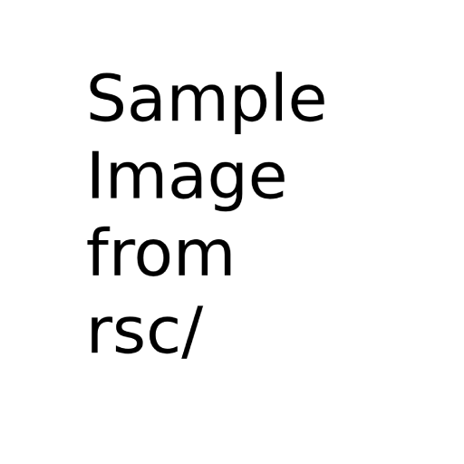

# Feature Showcase: Server Capabilities

Welcome! This page demonstrates the core features of the Markdown Static Blog Server.

---

## 1. Basic Markdown & GFM

This server renders standard Markdown and GitHub Flavored Markdown.

### Formatting
You get **bold text**, *italic text*, `inline code`, and ~~strikethrough~~.

### Lists
*   Unordered Item 1
*   Unordered Item 2
    *   Nested item

1.  Ordered Item 1
2.  Ordered Item 2

### Blockquotes
> This is a blockquote. It's useful for highlighting text or quoting sources. Lorem ipsum dolor sit amet, consectetur adipiscing elit.

### Tables
GFM Tables are supported:

| Feature          | Status      | Example                  |
| :--------------- | :---------- | :----------------------- |
| Headings         | Supported   | `# Heading 1`            |
| Lists            | Supported   | `- Item` or `1. Item`    |
| Code Highlighting| Supported   | See section below        |
| LaTeX            | Supported   | $E=mc^2$                 |

---

## 2. Links

Navigate internally or link to external sites.

*   **Internal (Root-Relative):** Go to the [First Blog Post](/blog/post1).
*   **Internal (Category Index):** Visit the main [Blog Index](/blog).
*   **External:** Visit an external site like the [Markdown Guide](https://www.markdownguide.org/).

---

## 3. Images & Asset Resolution

Images referenced relatively are resolved correctly. The *same* image (`sample.png` located in `data/blog/rsc/`) is referenced below using two path styles:

*   **Relative Path from this file (`data/tutorials/intro.md`):**
    ``
    

*   **Absolute Asset Path (Server Resolved):**
    ``
    

*(Note: Both should display the same image if `data/blog/rsc/sample.png` exists)*

---

## 4. Code Blocks with Syntax Highlighting

Fenced code blocks with language identifiers get automatic syntax highlighting via `highlight.js`.

**JavaScript Example:**
```javascript
// Function to toggle a CSS class on an element
function toggleAnimation(elementId, className) {
  const element = document.getElementById(elementId);
  if (element) {
    element.classList.toggle(className);
    console.log(`Toggled class '${className}' on #${elementId}`);
  } else {
    console.error(`Element with ID #${elementId} not found.`);
  }
}

// Example usage might be added later in a <script> tag
// document.addEventListener('DOMContentLoaded', () => {
//   const btn = document.getElementById('animated-button');
//   if(btn) btn.addEventListener('click', () => toggleAnimation('animated-button', 'pulse-animation'));
// });
```

**Python Example:**
```python
# Simple Python example
def greet(name="World"):
  """Greets the given name."""
  print(f"Hello, {name}!")

greet("Feature Tester")
```

---

## 5. LaTeX Math Expressions

Render beautiful math equations using KaTeX.

*   **Inline Math:** The famous equation $E = mc^2$ looks great inline. We can also write formulas like $\frac{\alpha}{\beta} = \gamma$.
*   **Block Math:** For larger equations, use double dollar signs:
    $$
    \mathbf{J}(\theta) = \frac{1}{m} \sum_{i=1}^{m} \left[ -y^{(i)} \log(h_\theta(x^{(i)})) - (1 - y^{(i)}) \log(1 - h_\theta(x^{(i)})) \right] + \frac{\lambda}{2m} \sum_{j=1}^{n} \theta_j^2
    $$

---

## 6. Custom Template Injection

Inject reusable Markdown snippets from the `./template/` directory. Here, we inject `template/custom.md` with specific data:

**Result:**
!{{custom}{ "name": "Intro Page Reader", "p2": "Showcasing Templates" }}

---

## 7. Raw HTML, CSS, and JavaScript

You can embed raw HTML, including styles and scripts.

**Example: An Animated Button**

This button uses inline `<style>` for animation and inline `<script>` for interaction.

<style>
  /* Basic button style */
  .feature-button {
    padding: 10px 20px;
    font-size: 1em;
    cursor: pointer;
    border: 1px solid #007bff;
    background-color: #007bff;
    color: white;
    border-radius: 5px;
    transition: background-color 0.3s ease, transform 0.1s ease;
    margin: 10px 0;
  }

  .feature-button:hover {
    background-color: #0056b3;
  }

  .feature-button:active {
    transform: scale(0.98);
  }

  /* Simple pulse animation class */
  .pulse-animation {
    animation: pulse 0.8s infinite alternate;
  }

  @keyframes pulse {
    0% {
      transform: scale(1);
      box-shadow: 0 0 0 0 rgba(0, 123, 255, 0.7);
    }
    70% {
      transform: scale(1.05);
      box-shadow: 0 0 10px 10px rgba(0, 123, 255, 0);
    }
    100% {
      transform: scale(1);
      box-shadow: 0 0 0 0 rgba(0, 123, 255, 0);
    }
  }
</style>

<!-- The HTML Button -->
<button id="animated-button" class="feature-button">Click to Animate!</button>

<!-- The JavaScript -->
<script>
  // Ensure the DOM is loaded before adding the listener
  document.addEventListener('DOMContentLoaded', () => {
    const button = document.getElementById('animated-button');
    if (button) {
      button.addEventListener('click', () => {
        // Toggle the animation class
        button.classList.toggle('pulse-animation');

        // Update button text (optional)
        if (button.classList.contains('pulse-animation')) {
          button.textContent = 'Animating! Click to Stop';
        } else {
          button.textContent = 'Click to Animate!';
        }
        console.log('Button animation toggled.');
      });
    } else {
      console.error('Animated button not found on DOM load.');
    }
  });
</script>

*(Click the button above to see the simple CSS animation triggered by JavaScript.)*

---

That covers the main features currently implemented by this server!
